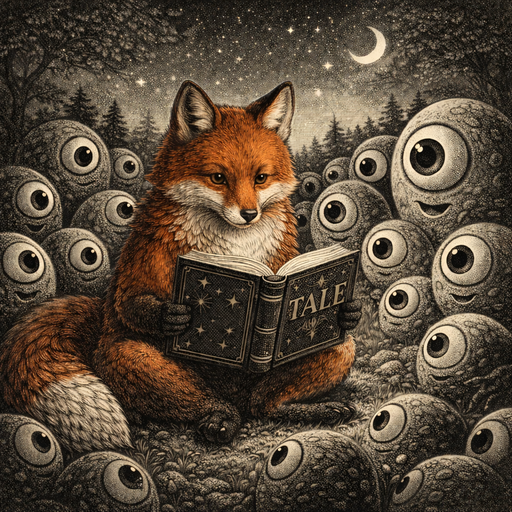

# Tale — Tales for AI agents  
<p align="center">
  
</p>

## TALE — Task Agreement & Logic Engine

**Tale** is a contract language for autonomous software work.

It is designed for **AI coding agents**, not humans issuing prompts.

A Tale file does not describe *how to think* — it defines:

- **what must become true**
- **where change is allowed**
- **how success is proven**
- **when results must be deterministic**
- **what must be protected from accidental change**

---

## What Tale Is

Tale is a **task contract**, not:
- a prompt format
- a patch format
- a workflow config
- a planning language

A Tale task is:
- **executable**
- **verifiable**
- **scope-enforced**
- **deterministic (when declared)**
- **replayable and auditable**

If a task cannot be mechanically verified, it is not a valid Tale.

---

## Core Philosophy

### Intent over narration
Tale separates **intent** (goal and constraints) from **implementation** (edits performed by an agent).

### Proof over trust
A task is only complete if its proof passes.  
“Looks correct” is not a completion state.

### Constraints are enforced, not suggested
Scope, locks, determinism rules, and Agentic Test lifecycle rules are enforced by the runner.

---

## The Three Laws of Tale

### Law 1 — Proof or it didn’t happen
Every Tale **must** define how success is mechanically verified.

### Law 2 — Scope is enforced
A Tale **must** define where work may and may not occur. Violations are execution errors.

### Law 3 — Intent ≠ Implementation
Tale specifies **what must become true**, not how an agent reasons.

---

## File Format

- Extension: `.tale`
- Line-oriented
- Human-readable
- Deterministic to parse

---

## Minimal Structure (v0)

```
TALE
META
GOAL
SCOPE
PLAN
PROOF
```

Optional sections supported in v0:

```
DETERMINISM
AGENTIC_TESTS
OVERRIDES
```

---

## Determinism & Reliability

Tale supports **explicit determinism contracts**.

### DETERMINISM

```
DETERMINISM
  mode strict | bounded | none
  canonicalize
    - prettier
    - sort_imports
  rerun_check runs=2
```

### Determinism Modes

- **strict**  
  Repeated executions must produce identical outputs (after canonicalization).

- **bounded**  
  Only declared artifacts must be identical.

- **none**  
  No determinism guarantees.

### Deterministic rerun (strong guarantee)

```
PROOF
  deterministic_rerun runs=2
```

The runner executes the same Tale multiple times and compares **normalized receipts**.
Any difference results in failure.

---

## Locks (No Accidental Changes)

Locked files or regions **must not change**.

```
PROOF
  hash_lock file="src/core/blah.ts"
  hash_lock region="src/core/blah.ts#function:blah"
```

Any modification causes failure unless explicitly unlocked via `OVERRIDES`.

---

## Agentic Tests (Correct Lifecycle)

**Agentic Tests** are a special kind of unit test designed to test the **agent's impact** on a codebase.

If an agent breaks something (behavior, API shape, invariants, forbidden churn), these tests should fail.

### Naming Convention (TypeScript)

Agentic tests use a distinct file pattern:

- `*.ai.test.ts`

### Why “DO_NOT_TOUCH true” is wrong

Agentic tests must be **created and improved** while a feature is being developed.

“Do not touch” should only apply **after the contract is proven stable** (e.g., production-ready).

So Tale models Agentic Tests as a **lifecycle**, not a boolean.

---

### Lifecycle: Draft → Stable (Frozen)

Tale supports two states for agentic tests:

- **draft**: editable within the current task
- **stable**: frozen after success; future tasks cannot change them without an override

This is controlled by the runner using a persistent lock record (recommended):
- `.tale/locks.json` (or equivalent)

---

### Declaring Agentic Test Policy

```
AGENTIC_TESTS
  pattern src/**/*.ai.test.ts
  allow_create true
  allow_modify within_task
  freeze_after proof_pass
```

#### Semantics

- **allow_create true**  
  The agent may create new agentic tests during PLAN.

- **allow_modify within_task**  
  The agent may modify agentic tests *during this task execution only*.

- **freeze_after proof_pass**  
  After PROOF succeeds, the runner:
  1) hash-locks all matching agentic tests
  2) stores their hashes in a persistent lock file (e.g. `.tale/locks.json`)
  3) treats them as **stable** for future tasks

In future tasks, modifying stable agentic tests is rejected unless explicitly overridden.

---

### Production Freeze Mode (Optional)

If the repo is already production/stable and you want tests frozen immediately:

```
AGENTIC_TESTS
  pattern src/**/*.ai.test.ts
  freeze_mode production
```

Runner behavior:
- lock all matching files **before** PLAN executes

---

### Overriding Frozen Agentic Tests (rare)

If you truly must change a frozen agentic test, it must be explicit and justified:

```
OVERRIDES
  unlock file="src/core/api.ai.test.ts" reason="API contract changed"
```

Recommended runner behavior:
- record the override prominently in the receipt
- require determinism `mode strict`
- require `deterministic_rerun runs=2`
- optionally require an expanded proof (lint + full suite)

---

## PLAN

PLAN contains **imperative edit primitives only**.

Agents propose operations; the runner enforces:
- scope
- locks
- determinism
- Agentic Test lifecycle rules (draft vs stable)

---

## PROOF

PROOF defines how success is verified.

If any proof step fails, the Tale fails.

Common proof primitives:
- `run "cmd" expect exit=0`
- `file_exists "path"`
- `file_contains "path" "text"`
- `hash_lock file=...`
- `hash_lock region=...`
- `deterministic_rerun runs=2`

---

## Execution Model (v0)

1. Parse & validate
2. Load persistent locks (e.g. `.tale/locks.json`)
3. Enforce scope & locks
4. Execute PLAN
5. Canonicalize outputs
6. Execute PROOF
7. Determinism checks
8. If configured, freeze Agentic Tests after proof
9. Produce execution receipt

---

## Status

Tale is **v0**.

The v0 goal is correctness, determinism, and safety — not convenience.

---

## Summary

Tale treats software work as a **deterministic contract**:

> “Within this scope, make this goal true —  
> and prove it, reproducibly, without breaking anything.”
