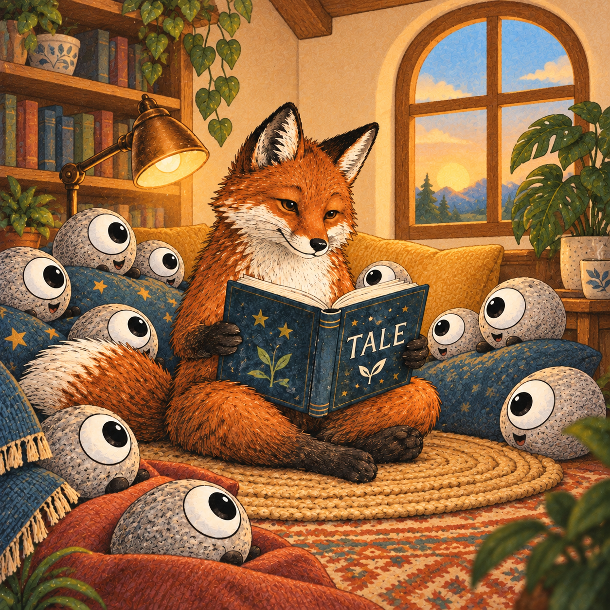
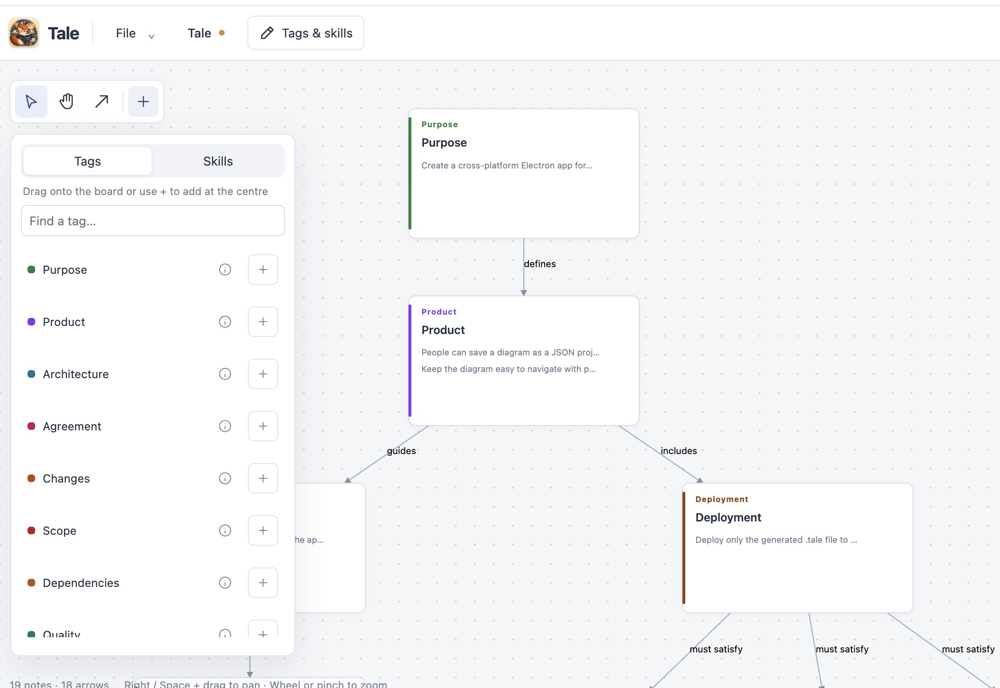
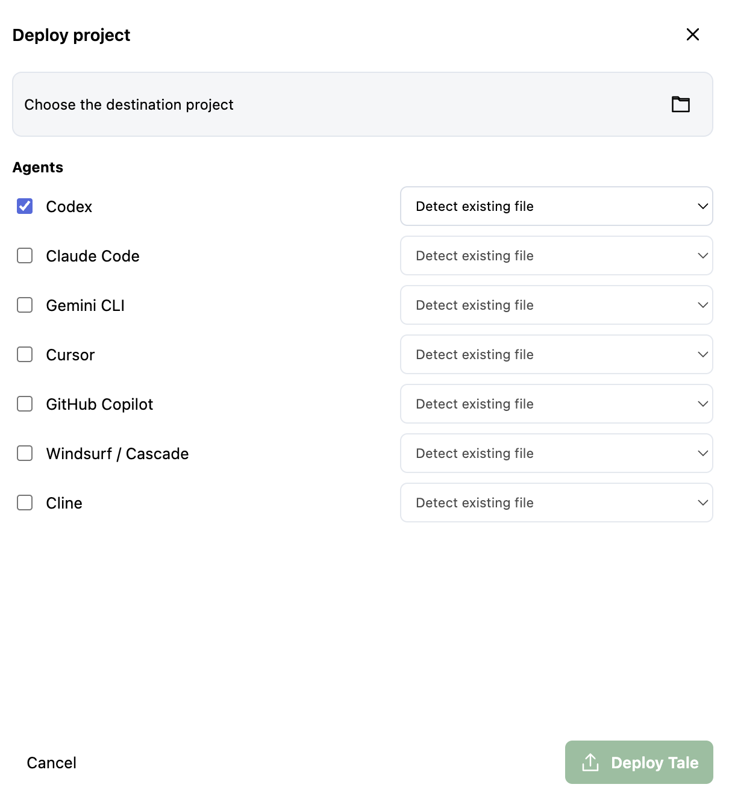

<h1 align="center">Tale — Tales for AI agents</h1>

## Purpose

Tale helps people explain goals, boundaries, decisions, and completion checks to AI coding agents. The desktop editor lets you arrange and connect these instructions visually. You save the editable diagram as a JSON project; Tale compiles its notes and relationships into one deterministic `.tale/project.tale` that agents can read through their project instruction files.

*An opened project: notes on the board express project instructions, and labelled arrows express relationships between them.*

## Tags and Skills

A **Tag** is a reusable instruction about what an agent should know or respect, such as Scope, Testing, or Do not be silly. A **Skill** is a reusable way to perform a kind of work, such as Bug investigation or Minimal change. Both have a name, a colour, and one plain-language text value. You can edit the supplied defaults or create your own.

The library holds defaults for future notes. Placing a Tag or Skill on the board makes an independent copy that you can rewrite for this project. Only placed notes are compiled into the `.tale` file; the saved JSON keeps the whole editable diagram and library.

## Built-in Tags

These are instructions **to the agent**, not technical settings. Use only the ones relevant to a project; rewrite their text to make the boundary or desired behaviour precise. The built-in defaults live in [catalogue.json](src/model/catalogue.json).

| Tag | Tell the agent to… |
| --- | --- |
| Goal | Keep work aligned with the requested outcome. |
| Agreement | Clarify real ambiguity and retain approvals already given. |
| Scope | Stay within the agreed files and behaviour. |
| Changes | Make the smallest reviewable change. |
| Protected areas | Seek the project's required approval before editing protected files. |
| Source of truth | Check current instructions, code, and tests before assuming. |
| Assumptions | Expose consequential guesses and verify them. |
| Decisions | Preserve agreed decisions or explain conflicting evidence. |
| Plan | Agree on steps and checks for consequential work. |
| Stop condition | Stop when the agreed outcome passes its checks. |
| Requirement | Treat each stated requirement as part of completion. |
| Check | Run an observable check for a requirement. |
| Testing | Test changed behaviour without rewriting tests to hide a defect. |
| Proof | Report actual results and limitations. |
| Review | Inspect the diff for regressions and unrelated changes. |
| Dependencies | Explain and seek required approval for additions. |
| Quality | Follow existing style and checks without weakening them. |
| Security | Respect trust boundaries and protect secrets. |
| Environment | Confirm which environment's rules apply. |
| Deployment | Preview destinations and obtain required authorization. |
| Rollback | Plan recovery before risky or irreversible changes. |
| Determinism | Verify identical inputs produce identical output. |
| Communication | Keep the user informed and ask concise questions. |
| Overrides | Record explicit, approved exceptions to project rules. |
| Handoff | State changes, checks, and remaining uncertainty. |
| Approval gate | Stop at an approval boundary and wait for an explicit yes. |
| No bypasses | Fix failing checks rather than disabling or weakening them. |
| Do not be silly | Compare the result with the request; correct unjustified refactors, hidden failures, and extra work. |

Approval gate, No bypasses, and Do not be silly give the agent concrete reasons to stop or correct its work. Clear wording helps communication; tests and human review still matter.

## Built-in Skills

Skills are task workflows written as plain-language notes in [skills.json](src/model/skills.json). They appear in a separate editor tab and compile under a `SKILL` heading. They are not executable plugins or installed agent skills.

| Skill | Starting workflow |
| --- | --- |
| Minimal change | Inspect the relevant code, make a focused edit, verify, and stop. |
| Bug investigation | Reproduce, isolate the cause, fix, and check the regression. |
| Pull request review | Inspect a diff and report concrete findings. |
| Test authoring | Add behavioural coverage for meaningful outcomes. |
| Refactoring | Preserve behaviour while changing agreed structure. |
| Dependency update | Review release notes, update one dependency, and check compatibility. |
| Migration | Validate each transition and its rollback path. |
| Security review | Inspect trust boundaries and report concrete risks. |
| Performance investigation | Measure before and after a targeted change. |
| Accessibility review | Check keyboard, focus, semantics, and visual accessibility. |
| Documentation update | Verify behaviour and update only affected docs. |
| Release preparation | Check versions and artifacts before authorized publication. |
| Incident response | Gather evidence, limit impact, and record recovery. |
| Repository onboarding | Learn instructions and architecture before editing. |
| UI implementation | Follow the existing design and verify interactions. |
| API implementation | Define and check the public contract. |
| Database change | Plan data and schema transitions with validation. |
| Commit preparation | Review scope, checks, and the proposed commit message. |

## Use the editor

1. Run `npm start` from a checkout with Node.js 22.12+ and npm. The app opens an empty, unsaved project.
2. Open **Tags & skills** to read or edit reusable defaults. Drag a Tag or Skill onto the board, or use its add button. Select a placed note to edit the text for this project. Default edits affect future placements; existing notes keep their own text.
3. Use **File → New project** for a blank or starter diagram, or **File → Open JSON** for a saved project. **Save** and **Save As** keep the editable JSON wherever you choose.
4. **Preview Tale** shows the generated text. **Deploy Tale** asks for a target project and agent entry points, writes `.tale/project.tale`, and updates selected agent instructions. It does not deploy the editor JSON.

The diagram can contain labelled arrows and environment-specific notes. Only placed notes and their meaningful relationships compile; positions, colours, zoom, and unused defaults do not. The same JSON always produces the same Tale bytes. See [project format](docs/project-format.md), [agent integration](docs/agent-integration.md), and [templates](templates/README.md).

## Deploy to AI agents

Choose a destination project and one or more agents: **Codex, Claude Code, Gemini CLI, Cursor, GitHub Copilot, Windsurf / Cascade, or Cline**. For each agent, Tale can detect an existing supported instruction file or use a path you select. It previews which files will be created or updated before deploying the generated `.tale/project.tale`. Existing instructions outside Tale's managed block and unrelated files are preserved.

For example, Codex can use `AGENTS.md`, Claude Code can use `CLAUDE.md`, and GitHub Copilot can use `.github/copilot-instructions.md`. Other supported paths and activation details are in [agent integration](docs/agent-integration.md). After deployment, check that the chosen agent actually loaded the Tale; installing an instruction file alone does not establish that.

## Tale diagrams are made for humans

People do not naturally think in configuration files, schemas, or isolated rule sets. We think in ideas, relationships, intentions, examples, warnings, priorities, exceptions, and associations.

Those thoughts also exist at very different levels. We may start with a broad idea such as what a project is trying to achieve, then move gradually toward more concrete decisions about how the work should be done, what should be protected, and what technical rules should be followed.

That means one conversation may contain both high-level intentions — such as the purpose of a project or the way we want an AI agent to behave — and very specific instructions, such as *hich compiler option to use, which files must not change, or which linter must pass.

Tale is designed to let all of these levels of thought exist together instead of forcing them into separate configuration systems.

Tale allows all of these different kinds of thoughts to exist together, and concider them to a **two ways communication**. 

This is one of the central ideas behind Tale:

**Communication with AI should not be designed in the same way as configuration for traditional software.**

Traditional software needs strict formats because a parser must understand them. A configuration file separates concepts into predefined fields because software can only process the structures that its developers explicitly implemented.

Now we can finally communicate with our software the way we always wanted to — we just need to believe that this is actually possible. :)

Yes, it happened. Really.

You can start forgetting about some of those painfully strict configuration files and simply **tell the AI what you want**. It can understand concepts, intentions, rules, examples, and relationships without requiring everything to be squeezed into a rigid predefined format.

I think we humans sometimes still struggle to accept this. We have spent decades learning how to communicate with machines through strict languages, schemas, interfaces, and configuration files, so naturally we keep trying to drag AI back into those familiar old methods.

But something has changed.

**We can talk to our machines now.**

So yes, the Terminator is here — but instead of travelling back in time to destroy humanity, it mostly wants to write you a new Tetris game, fix your build, or implement your cool — or perhaps not-so-cool — idea. :)

**So yes, an AI agent is different when it comes to communication.**

It can understand **natural language, concepts, relationships, examples, technical instructions, and project-specific terminology**.

Because of this, humans do not necessarily need one configuration system for architecture, another for coding rules, another for project requirements, another for workflow, and another document explaining the original intention behind all of them.

**We can tell one coherent Tale.**

The challenge is no longer only making information machine-readable.

The challenge is helping humans express what they mean **clearly, consistently, and without creating a large, contradictory, repetitive, or disorganized collection of instructions**.

**This is where the diagram helps.**

The diagram gives humans a place to **organize their thinking before it reaches the AI**.

They can separate ideas, connect related concepts, identify priorities, describe rules, record decisions, define acceptance criteria, and move between **high-level intentions and very specific instructions** without forcing everything into the same rigid structure.

## TAGs are shared human words

A Tag is a name for something important to tell an agent, not a fixed form to fill in. **Do not be silly** is a real built-in Tag: its text tells an agent to compare its result with the request and correct unwarranted changes. You can rewrite it or create another Tag with any unique, meaningful name. The app handles technical identifiers internally.

A Tale makes intentions, boundaries, decisions, and checks visible. It does not itself force an agent to obey a note or run a check.

## Development

The app keeps the model and compiler (`src/model`, `src/application`), SVG board (`src/svg`, `src/editor`), UI (`src/ui`), and Electron main/preload code (`src/main`, `src/preload`) separate. It uses no UI or diagram library.

Run `npm run verify` for type checking, Biome, unit tests, and Electron end-to-end tests. Every TypeScript source file has a sibling `.test.ts`. This project's own instructions are in [.tale/project.tale](.tale/project.tale).

## About Me and what is Tale

Hey, I’m Janos, an experienced software engineer with more than 20 years of experience in software industry. I’m also a psychology student with a deep interest in human psychology, consciousness, thinking, AI, and the communication between humans and AI.

The reason I created Tale is that I felt we are still trying to communicate with AI using old tools, existing methodologies, and principles that may no longer be valid.

I believe we need to change the way we communicate if we want to work successfully with AI in the future. **Communication is the key.**

We also need to change our mindset. We do not necessarily need rigid, predefined languages like HTML, traditional configuration formats, interfaces, or pseudo-languages for every kind of interaction. AI can understand many different kinds of structures, concepts, relationships, and logic — much like we humans do.

Because of that, I believe the whole concept of **how humans communicate with AI needs to evolve**.

This is what I am trying to explore and implement with Tale.

Tale allows people and teams to create their **own project-specific communication language** instead of forcing every project into the same predefined structure. It also provides communication TAGs that can help humans and AI share goals, rules, expectations, decisions, warnings, acceptance criteria, and other important information more clearly.

My goal with Tale is to help make **human–AI collaboration more natural, understandable, flexible, and effective**.
